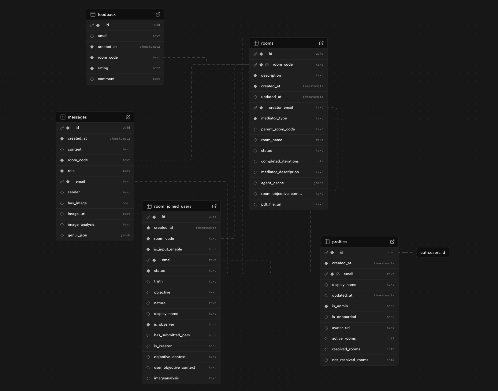

# ResolveWithAI Backend API

FastAPI backend for [ResolveWithAI](https://resolvewith.ai/landing), an AI-mediated conflict-resolution platform. It manages private participant caucuses, multi-agent mediation, persistent conversation state, and bounded resolution workflows.

🚧 Looking to run AI simulations of the conflict resolution process locally? Switch to the `local-testing-branch`.

## Table of Contents

1. [Overview](#overview)
2. [Quick Start](#quick-start)
3. [Installation & Setup](#installation--setup)
4. [Running the Application](#running-the-application)
5. [Database Architecture](#database-architecture)
6. [Mediation Process](#mediation-process)
7. [API Documentation](#api-documentation)
8. [API Usage Flow](#api-usage-flow)
9. [Support](#support)

## Overview

ResolveWithAI Backend is a FastAPI service that manages and facilitates AI-mediated conflict resolution between participants. The API handles room creation, participant management, message exchange, and orchestrates the mediation process between human participants and AI mediators.

### Key Features

- **Room Management**: Create parent rooms (mediation) and breakout rooms (private consultation)
- **Participant Control**: Manage users, observers, and AI representatives
- **Message Handling**: Process text and image messages with AI analysis
- **Access Control**: Role-based permissions for different user types
- **Real-time Mediation**: Automated AI-driven conflict resolution process

## Quick Start

### Prerequisites

- Python 3.11+
- Supabase account
- OpenAI API key

### Environment Variables

Copy `.env.example` to `.env` and supply the required values:

```env
SUPABASE_URL=https://your-project.supabase.co
SUPABASE_KEY=
OPENAI_API_KEY=
TESTING_MODE=false
EXTRA_MODELS_KEY=
ENVIRONMENT=development
CORS_ORIGINS=http://localhost:3000
CORS_ORIGIN_REGEX=
```

## Installation & Setup

### 1. Install Dependencies

```bash
pip install -r requirements.txt
```

### 2. Install UV Package Manager

We use [UV](https://github.com/astral-sh/uv) for dependency management:

```bash
pip install uv
```

### 3. Managing Dependencies

To add new dependencies:

1. Add the package to `requirements.in`
2. Compile the requirements:
   ```bash
   uv pip compile requirements.in -o requirements.txt
   ```

## Running the Application

### Development Mode

```bash
make run-dev
```

> **Note**: Restart the service after making code changes to see updates.

### Production Deployment

The included Dockerfile runs the API on port `8000` and exposes `/healthz` for platform health probes. The current demo deployment uses Azure Container Apps. Configure all secrets through the platform rather than committing a `.env` file.

To rebuild the image in Azure Container Registry and update the existing demo Container App:

```bash
./deploy.sh <image-tag>
```

The script uses the existing demo resource names by default. Override them with `AZURE_RESOURCE_GROUP`, `AZURE_REGISTRY_NAME`, `AZURE_CONTAINER_APP`, or `AZURE_IMAGE_NAME` when deploying to another environment.

### Important Configuration

After starting the application:

1. Copy the deployed HTTPS API URL
2. Set it as `NEXT_PUBLIC_BACKEND_URL` in your ResolvewithAI frontend
3. Add the frontend production URL to `CORS_ORIGINS` on the backend
4. Redeploy the frontend so the public environment variable is embedded in the build

## Database Architecture

ResolveWithAI uses a PostgreSQL database hosted on [Supabase](https://www.supabase.com) with a structured schema designed for conflict resolution workflows.

### Database Schema Overview



The database consists of **five main tables**: `profiles`, `rooms`, `room_joined_users`, `messages`, and `feedback`.

### Room Structure Concept

- **Parent Room**: Main mediation space where AI mediators facilitate resolution
- **Breakout Rooms**: Private consultation spaces for each participant with their AI representative
- **Access Control**: Participants only access their own breakout room; observers access parent room and all breakout rooms

### Core Tables

#### 1. Profiles Table

Stores user account information linked to Supabase `auth.users`.

```python
profile_id: UUID              # Unique user identifier
created_at: PastDatetime      # Account creation timestamp
updated_at: PastDatetime      # Last update timestamp (optional)
email: EmailStr               # User email (primary key for relations)
display_name: str             # User display name (optional)
is_admin: bool                # Admin privileges flag
is_onboarded: bool            # Onboarding completion status
avatar_url: HttpUrl           # Profile picture URL (optional)
active_rooms: int             # Current active room count
resolved_rooms: int           # Successfully resolved room count
not_resolved_rooms: int       # Unresolved room count
```

#### 2. Rooms Table

Manages both parent rooms (mediation) and breakout rooms (private consultation).

```python
room_id: UUID                    # Unique Supabase identifier
room_code: str                   # 13-character user-facing room code
description: str                 # Conflict description
created_at: PastDatetime         # Creation timestamp
updated_at: PastDatetime         # Last update timestamp (optional)
creator_email: EmailStr          # Room creator's email
mediator_type: MediatorType      # 'HR' or 'General'
parent_room_code: str            # Parent room code (for breakout rooms only)
room_name: str                   # Display name (optional)
status: str                      # Room status (see status options below)
completed_iterations: int        # Mediation round counter (optional)
mediator_description: str        # Mediator description (optional)
agent_cache: dict                # AI mediator cached state (optional)
room_objective_context: str      # Summarized room context (optional)
pdf_file_url: HttpUrl            # Uploaded file URL (optional)
```

**Room Status Options**: `init`, `in_caucus`, `awaiting_mediation`, `in_mediation`, `satisfied`, `resolved`, `no_resolution`

**Room Code vs Room ID**: 
- `room_id`: Internal hexadecimal Supabase identifier (hidden, immutable)
- `room_code`: 13-character alphanumeric user-facing code (used in URLs and access)

#### 3. Room Joined Users Table

Links users to rooms and manages participant metadata. Each user has separate entries for parent and breakout room access.

```python
participant_id: UUID           # Unique participant instance ID
created_at: AwareDatetime      # Participant creation timestamp
room_code: str                 # Associated room code
is_input_enable: bool          # Input permission flag
email: EmailStr                # Participant email
display_name: str              # Participant display name
status: str                    # Room status
truth: str                     # User's truth statement (optional, testing)
objective: str                 # User's goal (optional, testing)
nature: str                    # Personality type (optional, testing)
is_observer: bool              # Observer role flag
has_submitted_persp: bool      # Perspective submission status (optional)
is_creator: bool               # Room creator flag
objective_context: str         # User's conflict perspective (optional)
user_objective_context: str    # User's room objective version (optional)
imageanalysis: str             # Image evidence analysis (optional, testing)
```

**AI Bot Fields**: `truth`, `objective`, `nature`, and `imageanalysis` are used for AI dummy participants that a user can opt for as the opposing party.

#### 4. Messages Table

Stores all communication within the platform, including human messages, AI responses, and system summaries.

```python
message_id: UUID              # Unique message identifier
created_at: AwareDatetime     # Message timestamp
content: str                  # Message body
room_code: str                # Room where message was sent
role: Role                    # Sender role (see roles below)
email: EmailStr               # Associated participant email
sender: str                   # Sender name/identifier
has_image: bool               # Image attachment flag
image_url: HttpUrl            # Image URL (optional)
image_analysis: str           # AI image analysis (optional)
genui_json: dict              # Dynamic UI component data (optional)
```

**Message Roles**: `user`, `advisor`, `mediator`, `representative`, `system`

#### 5. Feedback Table

Collects user feedback after mediation completion.

```python
id: UUID                      # Unique feedback identifier
email: EmailStr               # Feedback submitter email
created_at: PastDatetime      # Submission timestamp
room_code: str                # Associated room code
rating: int                   # Star rating (1-5)
comment: str                  # Written feedback (optional)
```

## Mediation Process

The AI-mediated resolution follows these phases:

1. **Initialization**: Room created with participants
2. **Caucus Phase**: Participants consult with AI representatives in breakout rooms
3. **Mediation Phase**: AI mediators facilitate resolution in parent room with representatives of participants
4. **Resolution**: Agreement reached or process concluded
5. **Feedback**: Participants provide experience ratings (directly from frontend to database)

## API Documentation

### Access Control & Roles

The API supports four distinct access levels:

| Role | Description | Access Level |
|------|-------------|--------------|
| **admin** | ResolvewithAI team members (described as is_admin = true) | Full system access |
| **authenticated user** | Individual users (described as is_admin = false) | Own rooms only |

### Endpoint Categories

#### Internal Endpoints
- **Purpose**: Development, testing, and debugging
- **Access**: Admin users only
- **Visibility**: Not publicly exposed

#### External Endpoints
- **Purpose**: User interaction with the application
- **Access**: Role-based permissions
- **Visibility**: Publicly accessible

### Health

#### `GET /`
Performs a basic health check to verify that the API is operational.

**Response**
```json
{
  "message": "API is super healthy"
}
```

### Messages

#### `POST /message/send`
Sends a new message to a specified room. External Endpoint.

**Request Body**
```json
{
  "room_code": "ABC123",
  "content": "Let's discuss this issue.",
  "has_image": true,
  "image_url": "https://example.com/image.png",
  "image_analysis": "Image contains a pie chart."
}
```

**Response**
```json
{
  "id": "ac32c7c4-58d1-4e7b-9f09-c1e2a1e2b731",
  "content": "Let's discuss this issue.",
  "email": "user@example.com",
  "role": "user",
  "created_at": "2025-06-13T15:42:00Z",
  "has_image": true,
  "image_url": "https://example.com/image.png",
  "image_analysis": "Image contains a pie chart."
}
```

#### `POST /room/{room_code}/message`
Posts a message to a specific room (supports optional image analysis). External Endpoint.

**Request Body**:
```json
{
  "content": "Hello, this is my message",
  "has_image": false,
  "image_url": null,
  "image_analysis": null
}
```
**Response**: Same as `/message/send`

### Profiles

#### `GET /profile/`
Retrieves all user profiles. Internal Endpoint.

**Response**
```json
[
  {
    "profile_id": "123e4567-e89b-12d3-a456-426614174000",
    "email": "user@example.com",
    "display_name": "User Name",
    "created_at": "2023-06-13T12:30:45.123456",
    "updated_at": "2023-06-13T12:30:45.123456",
    "is_admin": false,
    "is_onboarded": true,
    "avatar_url": "https://example.com/avatar.jpg",
    "active_rooms": 1,
    "resolved_rooms": 2,
    "not_resolved_rooms": 0
  }
]
```

### Rooms

#### `GET /room/`
Retrieves a list of all rooms in the system. Internal Endpoint.

**Response**: 
```json
[
  {
    "room_id": "123e4567-e89b-12d3-a456-426614174000",
    "room_code": "ABCDEFGHIJKLM",
    "room_name": "Conflict Resolution",
    "creator_email": "creator@example.com",
    "status": "in_caucus",
    "created_at": "2023-06-13T12:30:45.123456",
    "updated_at": "2023-06-13T12:30:45.123456",
    "mediator_type": "general",
    "parent_room_code": null,
    "description": "Resolving a workplace conflict",
    "completed_iterations": 0
  }
]
```

#### `GET /room/me`
Retrieves all rooms associated with the authenticated user. External Endpoint.

**Response**: Array of room objects.
```json
[
  {
    "room_id": "123e4567-e89b-12d3-a456-426614174000",
    "room_code": "ABCDEFGHIJKLM",
    "room_name": "Conflict Resolution",
    "creator_email": "creator@example.com",
    "status": "in_caucus",
    "created_at": "2023-06-13T12:30:45.123456",
    "updated_at": "2023-06-13T12:30:45.123456",
    "mediator_type": "general",
    "parent_room_code": "BCDEFGHIJKLMN",
    "description": "Resolving a workplace conflict",
    "completed_iterations": 0
  }
]
```

#### `GET /room/{room_code}`
Retrieves detailed information about a specific parent room, including participants, observers, and breakout rooms. External Endpoint.

**Response**
```json
{
  "room": {
    "room_id": "123e4567-e89b-12d3-a456-426614174000",
    "room_code": "ABCDEFGHIJKLM",
    "room_name": "Conflict Resolution",
    "creator_email": "creator@example.com",
    "status": "init",
    "created_at": "2023-06-13T12:30:45.123456",
    "updated_at": "2023-06-13T12:30:45.123456",
    "mediator_type": "general",
    "parent_room_code": null,
    "description": "Conflict about project ownership",
    "completed_iterations": 0
  },
  "participants": [
    {
      "participant_id": "123e4567-e89b-12d3-a456-426614174000",
      "email": "user1@example.com",
      "display_name": "User One",
      "room_code": "ABCDEFGHIJKLM",
      "created_at": "2023-06-13T12:30:45.123456",
      "status": "init",
      "is_observer": false,
      "truth": null,
      "objective": null,
      "nature": null
    },
    {
      "participant_id": "223e4567-e89b-12d3-a456-426614174000",
      "email": "user2@example.com",
      "display_name": "User Two",
      "room_code": "ABCDEFGHIJKLM",
      "created_at": "2023-06-13T12:30:45.123456",
      "status": "init",
      "is_observer": false,
      "truth": null,
      "objective": null,
      "nature": null
    }
  ],
  "observers": [
    {
      "participant_id": "323e4567-e89b-12d3-a456-426614174000",
      "email": "observer@example.com",
      "display_name": "Observer",
      "room_code": "ABCDEFGHIJKLM",
      "created_at": "2023-06-13T12:30:45.123456",
      "status": "init",
      "is_observer": true,
      "truth": null,
      "objective": null,
      "nature": null
    }
  ],
  "breakout_rooms": {
    "user1@example.com": {
      "room_id": "423e4567-e89b-12d3-a456-426614174000",
      "room_code": "NOPQRSTUVWXYZ",
      "room_name": "Breakout Room - User One",
      "creator_email": "user1@example.com",
      "status": "init",
      "created_at": "2023-06-13T12:30:45.123456",
      "updated_at": "2023-06-13T12:30:45.123456",
      "mediator_type": "general",
      "parent_room_code": "ABCDEFGHIJKLM",
      "description": "Breakout room for User One",
      "completed_iterations": 0
    },
    "user2@example.com": {
      "room_id": "523e4567-e89b-12d3-a456-426614174000",
      "room_code": "ABCDEFGHIJKLN",
      "room_name": "Breakout Room - User Two",
      "creator_email": "user2@example.com",
      "status": "init",
      "created_at": "2023-06-13T12:30:45.123456",
      "updated_at": "2023-06-13T12:30:45.123456",
      "mediator_type": "general",
      "parent_room_code": "ABCDEFGHIJKLM",
      "description": "Breakout room for User Two",
      "completed_iterations": 0
    }
  }
}
```

#### `POST /room/initialise`
Creates and initializes a new room with participants and observers. Also initializes AI bot conversations. External Endpoint.

**Request Body**
```json
{
  "description": "Conflict about project ownership",
  "mediator_type": "general",
  "participants": [
    {
      "email": "user1@example.com",
      "display_name": "User One"
    },
    {
      "email": "user2@example.com",
      "display_name": "User Two"
    }
  ],
  "observers": [
    {
      "email": "observer@example.com",
      "display_name": "Observer"
    }
  ]
}
```

**Response**: Room details with participants, observers, and breakout rooms. Same as `/room/{room_code}`

#### `GET /room/{room_code}/conversations`
Retrieves the conversation history for a room. External Endpoint.

**Response**: Array of message objects.
```json
[
  {
    "message_id": "123e4567-e89b-12d3-a456-426614174000",
    "email": "user1@example.com",
    "sender": "User One",
    "created_at": "2023-06-13T12:30:45.123456",
    "content": "Hello, this is my message",
    "room_code": "ABCDEFGHIJKLM",
    "role": "user",
    "has_image": false,
    "image_url": null,
    "image_analysis": null
  },
  {
    "message_id": "223e4567-e89b-12d3-a456-426614174000",
    "email": "user1@example.com",
    "sender": "User One's Representative",
    "created_at": "2023-06-13T12:31:45.123456",
    "content": "Thank you for sharing your perspective. Can you tell me more about the situation?",
    "room_code": "ABCDEFGHIJKLM",
    "role": "advisor",
    "has_image": false,
    "image_url": null,
    "image_analysis": null
  }
]
```

#### `GET /room/{room_code}/participant/{email}`
Retrieves information about a specific participant in a room. External Endpoint.

**Response**: Participant object.

For human participant:
```json
{
  "participant_id": "123e4567-e89b-12d3-a456-426614174000",
  "email": "user1@example.com",
  "display_name": "User One",
  "room_code": "ABCDEFGHIJKLM",
  "created_at": "2023-06-13T12:30:45.123456",
  "status": "in_caucus",
  "is_observer": false,
  "truth": null, 
  "objective": null,
  "nature": null
}
```

For AI Bot Participant:
```json
{
  "participant_id": "123e4567-e89b-12d3-a456-426614174000",
  "email": "user1@example.com",
  "display_name": "AI Bot",
  "room_code": "ABCDEFGHIJKLM",
  "created_at": "2023-06-13T12:30:45.123456",
  "status": "in_caucus",
  "is_observer": false,
  "truth": "This is what I believe", 
  "objective": "This is what I want",
  "nature": "This is my personality"
}
```

#### `POST /room/{room_code}/participant`
Adds a participant to a room. Requires room creator authentication. External Endpoint.

**Request Body**
```json
{
  "email": "participant@example.com",
  "display_name": "New Participant",
  "is_observer": false
}
```

**Response**: Participant object. Same as `/room/{room_code}/participant/{email}`.

#### `DELETE /room/{room_code}/participant`
Removes a participant from a room. Requires room creator authentication. External Endpoint.

**Request Body**
```json
{
  "email": "participant@example.com"
}
```

**Response**
```json
{}
```

#### `GET /room/{room_code}/get_conflict_type`
Retrieves the conflict type for a given room. External Endpoint.

**Response**
```json
{
  "conflict_type": "general"
}
```

#### `POST /room/{room_code}/change_conflict_type`
Changes the conflict type of a room.

**Request Body**
```json
{
  "conflict_type": "hr"
}
```

**Response**
```json
{
  "room": "ABCDEFGHIJKLM",
  "conflict_type": "hr"
}
```

#### `GET /room/{room_code}/get_status`
Retrieves the current status of a room. External Endpoint.

**Response**
```json
{
  "status": "in_mediation"
}
```

#### `GET /room/{room_code}/breakout_rooms`
Fetches breakout room details for the authenticated user. External Endpoint.

**Response**: Breakout room object.
```json
{
  "room_id": "423e4567-e89b-12d3-a456-426614174000",
  "room_code": "NOPQRSTUVWXYZ",
  "room_name": "Breakout Room - User One",
  "creator_email": "user@example.com",
  "status": "in_caucus",
  "created_at": "2023-06-13T12:30:45.123456",
  "updated_at": "2023-06-13T12:30:45.123456",
  "mediator_type": "general",
  "parent_room_code": "ABCDEFGHIJKLM",
  "description": "Breakout room for User One",
  "completed_iterations": 0
}
```

## API Usage Flow

A typical mediation session follows this workflow:

1. **Room Creation**
   ```http
   POST /room/initialise
   ```
   Initialize room with participants and observers

2. **Room Access**
   ```http
   GET /room/{room_code}
   ```
   Fetch room details and participant information

3. **Message Exchange**
   ```http
   POST /room/{room_code}/message
   ```
   Users communicate through their breakout rooms

4. **Status Monitoring**
   ```http
   GET /room/{room_code}/get_status
   ```
   Track mediation progress (admin function)

5. **Conversation History**
   ```http
   GET /room/{room_code}/conversations
   ```
   Review message history and AI responses

## Support

For technical support or questions about the Osmobro API, please contact the ResolvewithAI development team.

---

**Repository**: [ResolvewithAI](https://www.github.com/predlico/ResolvewithAI)  
**API Documentation**: Available through FastAPI's built-in documentation at `/docs` endpoint
